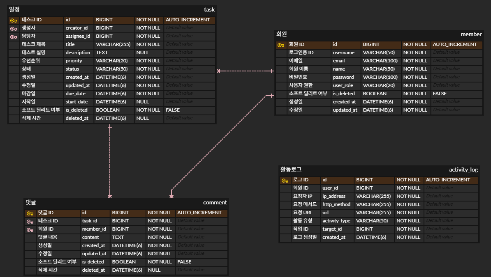

# 🧠 TaskFlow

# 일정 관리 서비스

---

## 📌 프로젝트 소개

TaskFlow는 사용자가 일정을 생성하고 담당자를 지정하며, 댓글과 상태 관리를 통해 프로젝트를 효율적으로 관리할 수 있도록 돕는 **칸반보드형 일정 관리 웹 애플리케이션**입니다.

---

## 👨‍👩‍👧 팀 소개 - 12조 박소희와 아이들

| 이름     | 역할              |
|----------|-------------------|
| 박소희(팀장)   | JWT 인증 / 인가       |
| 김도균(부팀장) | 사용자, 공통 응답, 로그 |
| 박민욱(팀원)   | 대시보드              |
| 이태겸(팀원)   | 일정(Task)            |
| 최희정(팀원)   | 댓글(Comment)         |

---

## ✅ 커밋 컨벤션

```bash
feat: 기능 추가
fix: 버그 수정
refactor: 코드 리팩토링
docs: 문서 수정
test: 테스트 코드 작성
style: 코드 포맷팅 (세미콜론, 줄바꿈 등)
```

---

## 🛠️ 기술 스택

| 구분        | 기술 요소 |
|-------------|-----------|
| Language    |  |
| Framework   |   |
| ORM         |  |
| Database    |  |
| IDE & Build |   |
| API Test    |  |
| Auth        |  |
| Logging     | AOP + Custom Annotation 기반 Activity Log |
| Container   |  |

---

## ✅ 요구사항

### 📌 필수 기능

| 기능 구분 | 상세 내용 |
|----------|-----------|
| 사용자   | 회원가입, 로그인, 회원 탈퇴 |
| 일정     | 일정 생성, 조회, 수정, 삭제 |
| 댓글     | 댓글 작성, 조회, 삭제 |
| 대시보드 | 통계 정보 제공, 내 일정 요약 |
| 활동 로그 | 주요 활동 기록, 활동 로그 조회 |

---

### 🚀 도전 과제

| 도전 기능 | 설명 |
|-----------|------|
| 프론트엔드 연동 | Docker 기반 프론트 통합 개발환경 구성 |
| Spring Security 커스터마이징 | JWT 인증 기반 로그인 및 권한 인가 처리 |
| AOP 기반 자동 로깅 시스템 | 커스텀 어노테이션 기반 주요 API 활동 기록 |

---

## ⚙️ 주요 기능 요약

- ✅ JWT 기반 로그인 / 회원가입 / 탈퇴
- ✅ 대시보드: 통계 정보 제공, 내 일정 요약
- ✅ 일정(Task) 생성, 수정, 상태 관리
- ✅ TODO → IN_PROGRESS → DONE 순서로 상태 변경 제한
- ✅ 댓글 생성 / 조회 / 삭제
- ✅ 활동 로그: 주요 활동 기록, 활동 로그 조회
- ✅ AOP 기반 API 로깅

---

## 🧩 도메인별 주요 기능

###  Auth (인증/인가)

| 기능 | 설명 |
|------|------|
| `POST /api/auth/register` | 회원가입 |
| `POST /api/auth/login` | 로그인 |
| `POST /api/auth/withdraw` | 회원 탈퇴 (비밀번호 확인 포함) |

---

###  Member (회원)

| 기능 | 설명 |
|------|------|
| `GET /api/users/me` | 로그인한 사용자의 프로필 조회 |
| `GET /api/users` | 전체 사용자 목록 조회 (담당자 지정용 등) |

---

###  Task (일정)

| 기능 | 설명 |
|------|------|
| `POST /api/tasks` | 일정 생성 |
| `GET /api/tasks` | 일정 목록 조회 (상태, 키워드, 담당자 필터 + 페이징) |
| `GET /api/tasks/{taskId}` | 일정 단건 조회 |
| `PUT /api/tasks/{taskId}` | 일정 수정 (담당자, 상태 포함) |
| `PATCH /api/tasks/{taskId}/status` | 일정 상태만 변경 (상태 전이 규칙 검증 포함) |
| `DELETE /api/tasks/{taskId}` | 일정 삭제 (Soft Delete 처리) |

---

###  Comment (댓글)

| 기능 | 설명 |
|------|------|
| `POST /api/tasks/{taskId}/comments` | 특정 일정에 댓글 작성 |
| `GET /api/tasks/{taskId}/comments` | 댓글 목록 조회 (최신순 + 페이징) |
| `DELETE /api/tasks/{taskId}/comments/{commentId}` | 댓글 삭제 |

---

###  Activity Log (활동 로그)

| 기능 | 설명 |
|------|------|
| `GET /api/activityLogs?activityType={activityType}&targetId={targetId}&startDate={startDate}&dueDate={dueDate}` | 활동 로그 조회 |

---

## 🖼️ ERD

> 

---

## 🧷 테스트

- 단위 테스트: JUnit 5 + Mockito 기반
- 목표 테스트 커버리지: 30% 이상


